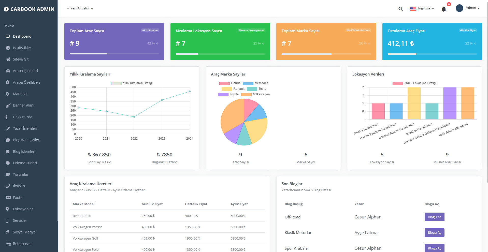
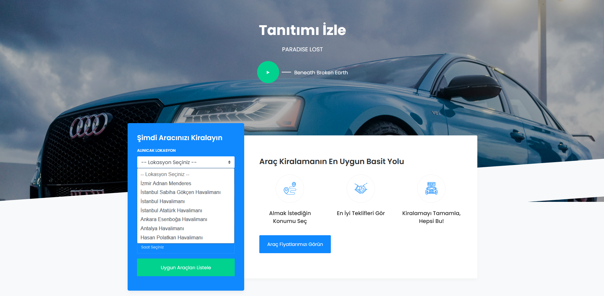
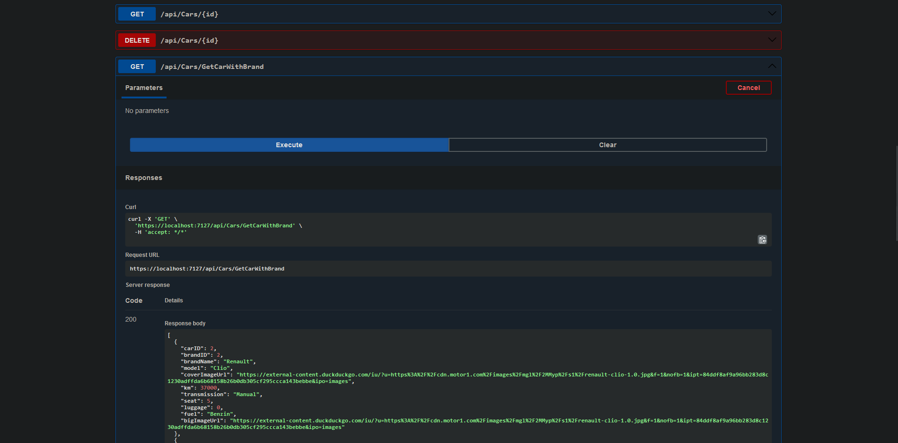
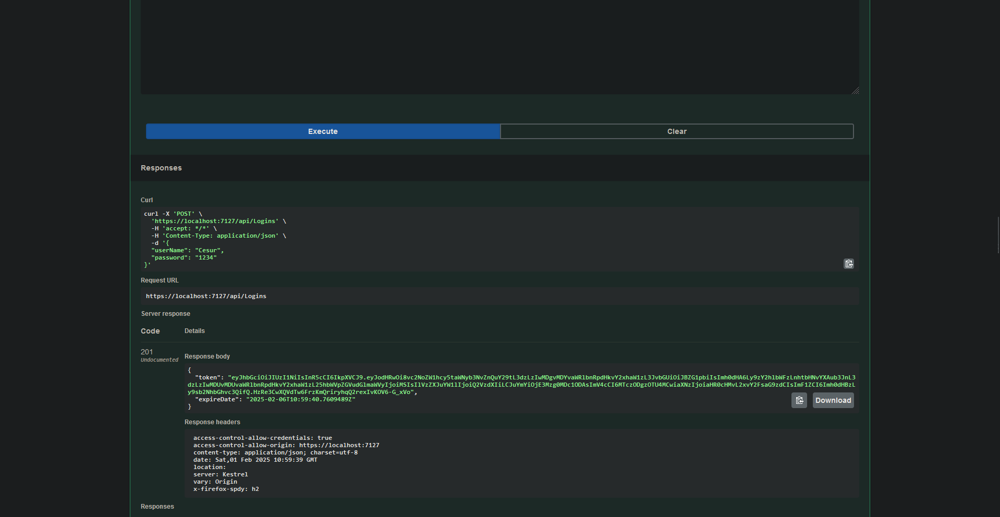
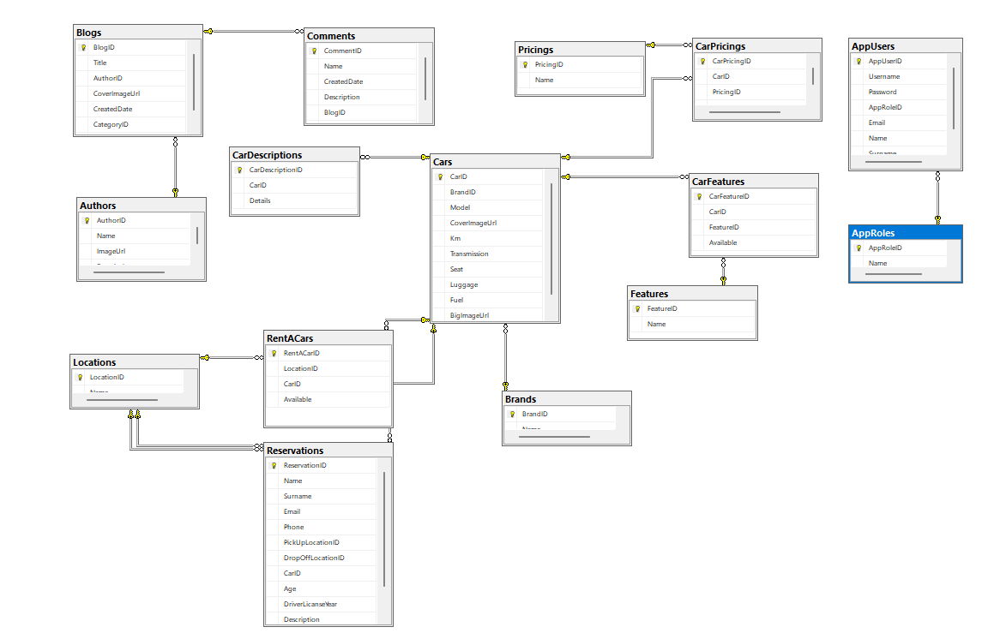
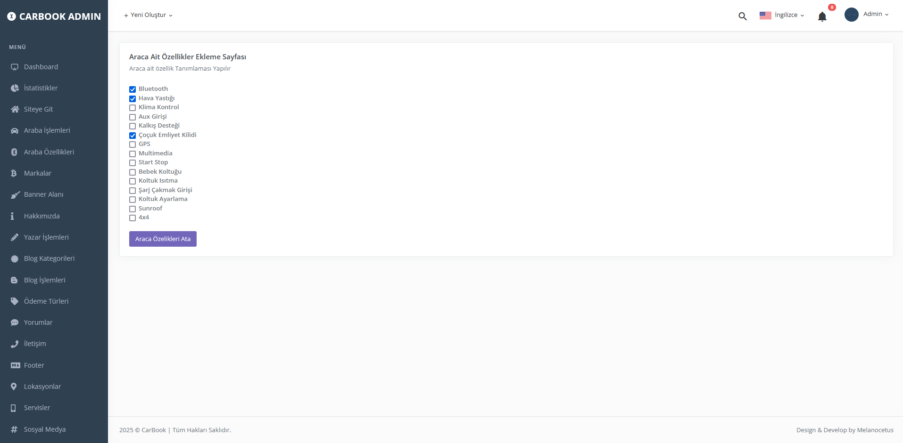
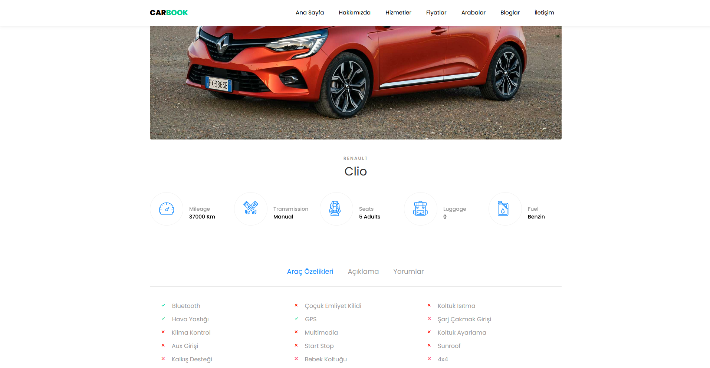
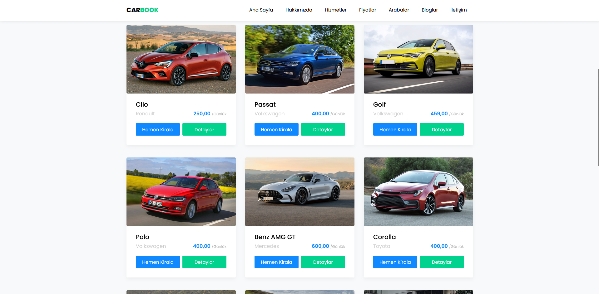
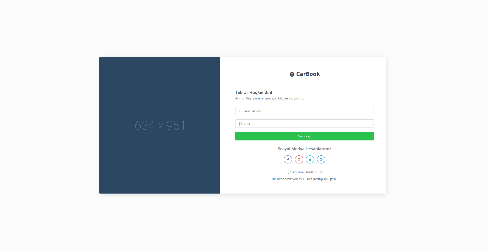

# CarBook - Onion Mimarisi ile CQRS, Mediator ve Repository Deseni
**CarBook**, **ASP.NET Core** kullanılarak geliştirilmiş ve katmanlı mimari ile tasarım desenlerini keşfetmeyi ve uygulamayı amaçlayan bir projedir. Bu proje, **Onion Mimarisi** ve **CQRS (Command Query Responsibility Segregation)**, **Mediator** ve **Repository** tasarım desenlerini içerir.

Projenin temel amacı, yazılım geliştirme süreçlerinde bu desenlerin nasıl entegre edileceğini ve doğru şekilde nasıl uygulanacağını öğrenmektir. **Mediator** deseni ile uygulamanın iş mantığı, komutlar ve sorgular arasındaki bağımsızlık sağlanırken, **Repository** deseni ile veri erişimi katmanı ayrıştırılmıştır.

## Ana Özellikler:
- **Onion Mimarisi** ile modüler ve sürdürülebilir yapı
- **CQRS** ile komut ve sorgu işlemlerinin ayrılması
- **Mediator Deseni** ile iş mantığı, komutlar ve sorgular arasında gevşek bağlılık
- **Repository Deseni** ile soyutlanmış veri erişimi ve geliştirilmiş test edilebilirlik

## Kullanılan Teknolojiler:
- **ASP.NET Core**
- **C#**
- **Entity Framework Core**
- **Mediator**
- **CQRS**
Bu proje, yazılım geliştirme ve tasarım desenleri kullanarak daha temiz, modüler ve sürdürülebilir uygulamalar geliştirmeyi öğretmeyi amaçlamaktadır.

Ekran goruntuleri

